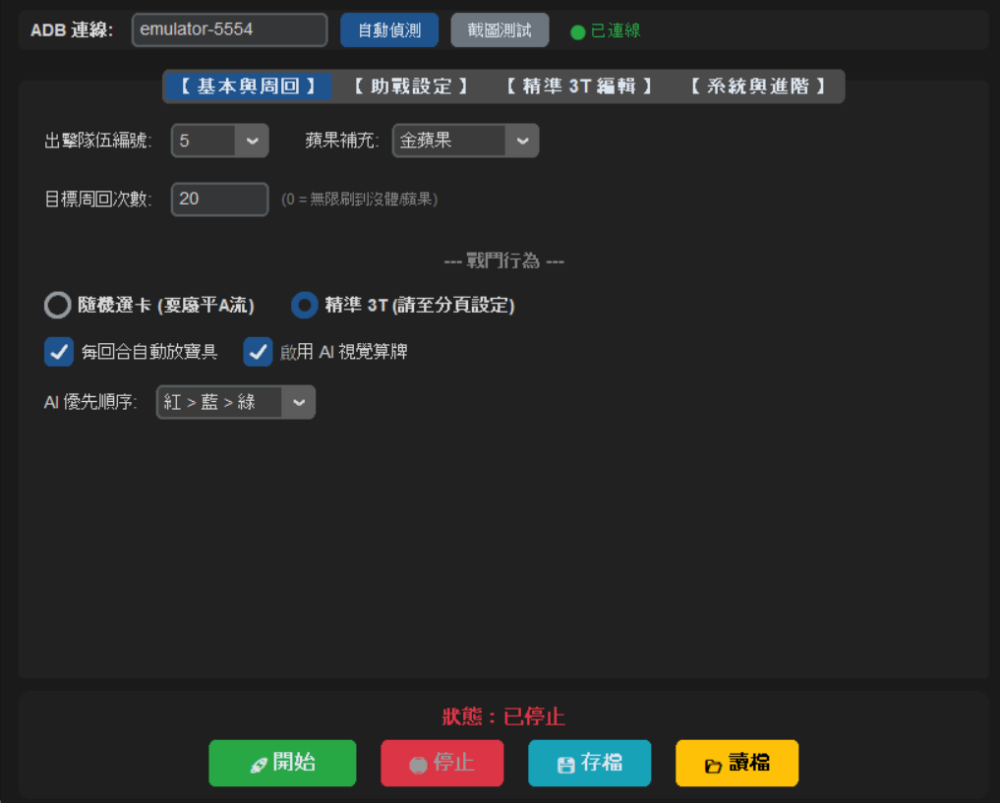
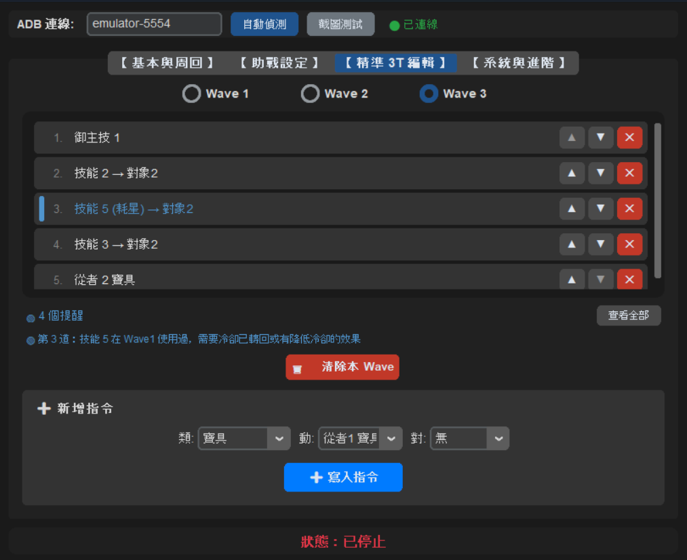
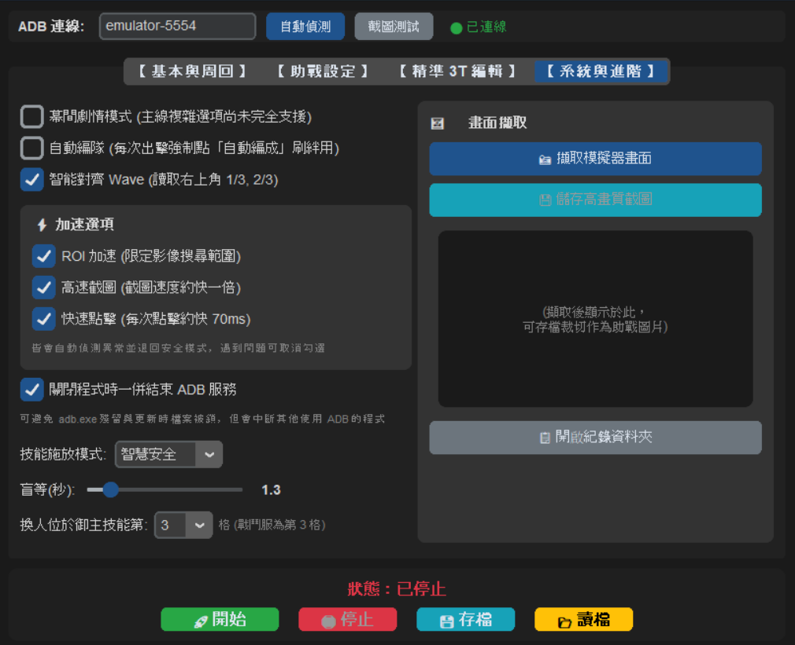

# FGO Auto

一套給 Fate/Grand Order 繁中服使用的桌面自動化工具，透過 ADB 操作 Android 模擬器，
以影像辨識判斷畫面狀態，可自動完成選擇助戰、出擊、依腳本施放技能、選卡、結算與連續周回。



---

## ⚠️ 免責聲明

- 本工具屬於**個人學習與研究性質**的專案，用途在於練習影像辨識與自動化流程設計。
- 多數線上遊戲的服務條款**禁止使用自動化工具**。使用本工具可能違反 Fate/Grand Order
  的使用者條款，並導致帳號受到警告、停權或永久封鎖。
- **使用者需自行承擔一切風險與後果**，作者不對任何帳號損失、資料損失或其他損害負責。
- 本專案不隸屬於 TYPE-MOON、Aniplex、DELiGHTWORKS 或 Komoe Game，
  相關商標與遊戲內容之著作權均屬各自所有者。
- 本工具不修改遊戲程式、不攔截或竄改網路封包，僅以模擬觸控的方式操作模擬器。

**如果你不接受以上條款，請不要使用本工具。**

---

## 功能

**周回自動化**
- 自動選擇助戰（可指定職階、從者圖片、禮裝圖片）
- 自動出擊、選擇隊伍、確認編成
- 體力不足時自動使用指定的蘋果
- 可設定目標周回次數，達成後自動停止

**戰鬥控制**
- **精準 3T**：逐波編排技能、寶具、換人、切換敵人等指令
- **隨機選卡**：不設定腳本，交給程式自動選卡
- **AI 視覺算牌**：依卡色優先順序挑選指令卡
- 三種技能施放模式：智慧安全（判斷冷卻）、標準無腦、極限盲操

**輔助功能**
- 腳本檢查：編輯時即時檢查設定是否合理，標示可能失效的指令
- 幕間劇情模式、自動編成
- 畫面擷取工具，方便裁切助戰辨識圖片
- 自動更新，並保留使用者的存檔與圖片
- 執行紀錄，方便回報問題

---

## 系統需求

- Windows 10 / 11
- Android 模擬器（MuMu、雷電、BlueStacks、夜神等），**解析度建議設為 1920×1080**
- 不需要另外安裝 ADB，程式已內建

---

## 安裝與使用

### 1. 下載

到 [Releases](https://github.com/Bumaw228/fgo_auto/releases) 下載最新版的 zip，
解壓縮到任意資料夾。

> **請勿解壓縮到 `C:\Program Files`**，該位置需要管理員權限，會導致自動更新失敗。
> 建議放在桌面或 `D:\` 之類的位置。

### 2. 開啟模擬器的 ADB

| 模擬器 | 設定位置 |
|---|---|
| MuMu 12 | 設定 → 其他 → 開啟「ADB 除錯」 |
| 雷電 | 設定 → 其他設定 → ADB 除錯選「開啟本地連線」 |
| BlueStacks 5 | 設定 → 進階 → 開啟「Android Debug Bridge」（該頁會顯示埠號） |
| 夜神 | 設定 → 開啟「ROOT 權限」與 ADB |

### 3. 連線

開啟 `FGOAuto.exe`，程式會自動偵測模擬器並顯示連線狀態。

若顯示未連線，按「自動偵測」；仍失敗的話，在 ADB 欄位手動填入連接埠：

- MuMu 12：`127.0.0.1:16384`（多開為 16416、16448…）
- 雷電：`127.0.0.1:5555`
- 夜神：`127.0.0.1:62001`
- BlueStacks 5：埠號每次啟動可能不同，請看模擬器設定頁面

按「截圖測試」能看到遊戲畫面，就代表連線正常。

### 4. 設定與執行

把遊戲停在**要刷的關卡的出擊畫面**（或大廳），設定好參數後按「開始」。

> **關卡位置很重要**：程式是以固定座標點選關卡的，請先把要刷的關卡
> **移到關卡列表的第一個位置**（最上方）。
> 例如畫面上有三個關卡時，要刷的那個必須排在第一個，否則會點到別的關卡。

---

## 各分頁說明

### 基本與周回

設定隊伍編號、蘋果種類、目標周回次數，以及戰鬥行為（隨機選卡或精準 3T）。

### 助戰設定

可指定要找的職階，以及最多三張從者圖片與三張禮裝圖片（**符合任一張即選取**，全部留空則選第一個）。

**圖片怎麼準備：**

1. 讓遊戲停在**選擇助戰的畫面**
2. 用「系統與進階 → 擷取模擬器畫面」拍下畫面，再按「儲存高畫質截圖」
3. 用小畫家之類的工具裁切，存成 PNG 放進 `assets_friends/servants`（從者）
   或 `assets_friends/craft_essences`（禮裝）
4. 回到「助戰設定」按「選取」載入

> **裁切的訣竅：只取一小塊有辨識度的特徵就好**，不需要整張頭像或整張禮裝。
> 例如從者取臉部的一部分、禮裝取圖案中最有特色的一角。
>
> 範圍越小越不容易受到周圍變動的干擾（等級、羈絆、技能等級這些數字每個人都不一樣），
> 辨識反而更穩定；截太大則容易因為一點差異就找不到。

### 精準 3T 編輯



逐波編排指令。每一道指令都可以上移、下移或刪除。

編輯時會即時檢查設定，並在有問題的指令旁標示顏色：

| 標示 | 意義 |
|---|---|
| 🔴 | 該指令必定失效，例如順序錯誤或編號超出範圍 |
| 🟡 | 建議確認，多數情況下是設定錯誤 |
| 🔵 | 提醒，需要搭配特定隊伍或效果才成立 |

點選任一列可以看到詳細說明，或按「查看全部」列出所有問題。

> **指令順序的重要規則**：寶具必須排在所有技能之後。
> 因為第一道寶具指令會按下 Attack 進入選卡畫面，之後就無法再操作技能或切換敵人。

### 系統與進階



進階開關、技能施放模式、加速選項，以及畫面擷取工具。

**加速選項**三項皆預設開啟，並且都會自動偵測異常並退回安全模式。若懷疑造成問題可以取消勾選：

- **ROI 加速**：限定影像搜尋範圍，大幅提升畫面判斷速度
- **高速截圖**：免壓縮傳輸，截圖速度約快一倍
- **快速點擊**：每次點擊約快 70 毫秒

---

## 常見問題

### 找不到模擬器 / 顯示未連線

1. 確認模擬器已開啟，且已在模擬器設定中開啟 ADB 偵錯
2. 按「自動偵測」
3. 仍失敗則手動填入連接埠（見上方對照表）
4. 按「截圖測試」確認是否真的連上

### 防毒軟體或 Windows 攔截

本程式以 PyInstaller 打包，且需要控制模擬器、模擬觸控、擷取畫面，
這些行為與部分惡意軟體的特徵相似，因此可能被誤判。

程式不會連線到 GitHub 以外的網站，也不會蒐集或上傳任何個人資料。
若不放心，可以自行從原始碼執行。

遇到攔截時，請將程式資料夾加入防毒軟體的排除清單。

### 自動更新失敗，顯示 adb.exe 無法覆蓋

常駐的 ADB 服務鎖住了檔案。v1.2.1 之後已自動處理，
若仍遇到，主程式通常已更新完成，直接手動開啟 `FGOAuto.exe` 確認版本即可。

也可以到「系統與進階 → 關閉程式時一併結束 ADB 服務」勾選，減少此問題。

### 一直在刷新助戰

代表找不到指定的助戰圖片。請確認：

- 圖片是否裁切得太大（帶到會變動的背景）或太小
- 該從者是否真的有好友持有
- 職階篩選是否正確

刷新達到上限（30 次）後腳本會自動停止並提示。

### 技能沒放到 / 選卡怪怪的

先取消「加速選項」中的**快速點擊**再試。若情況改善，代表模擬器對極短的觸控反應不佳。

### 腳本卡住不動

到「系統與進階 → 開啟紀錄資料夾」，把最新的 log 檔附在問題回報中。

---

## 回報問題

請到 [Issues](https://github.com/Bumaw228/fgo_auto/issues) 開新議題，並附上：

1. **紀錄檔**（系統與進階 → 開啟紀錄資料夾，取最新的一份）
2. 使用的模擬器與版本
3. 問題發生時的畫面截圖

紀錄檔只包含程式的執行訊息，不含帳號資訊或個人資料。

---

## 開發者資訊

### 執行環境

```bash
pip install customtkinter opencv-python numpy pillow
python main_ui.py
```

### 打包

```bash
pyinstaller --onedir --name FGOAuto --collect-all customtkinter --noconsole ^
            --icon "assets_ui/app_icon.ico" main_ui.py
```

打包後需將 `assets_system`、`assets_ui`、`assets_friends`、`assets_saves`、
`platform-tools` 複製到 exe 同一層。

### 模組結構

| 模組 | 職責 |
|---|---|
| `main_ui.py` | 圖形介面、設定管理、存讀檔 |
| `fgo_logic.py` | 狀態機主迴圈與跨模組共用工具 |
| `fgo_core.py` | ADB 通訊、截圖、影像比對 |
| `fgo_vision.py` | 技能冷卻與 SKIP 按鈕等視覺判斷 |
| `fgo_combat.py` | 戰鬥流程與腳本指令執行 |
| `fgo_nav.py` | 選單導航（大廳、助戰、編成、結算） |
| `coords.py` | 座標、搜尋範圍與各項門檻常數 |
| `script_check.py` | 腳本乾跑檢查（純邏輯，可離線測試） |
| `fgo_logger.py` | 日誌系統 |
| `updater.py` | 自動更新 |

遊戲改版導致按鈕位移時，多數情況只需要修改 `coords.py`。

---

## 授權

本專案採用 MIT License，詳見 [LICENSE](LICENSE)。

授權範圍不包含 `assets_system` 等資料夾內擷取自遊戲畫面的圖片素材，
該部分著作權屬於原權利人所有。
